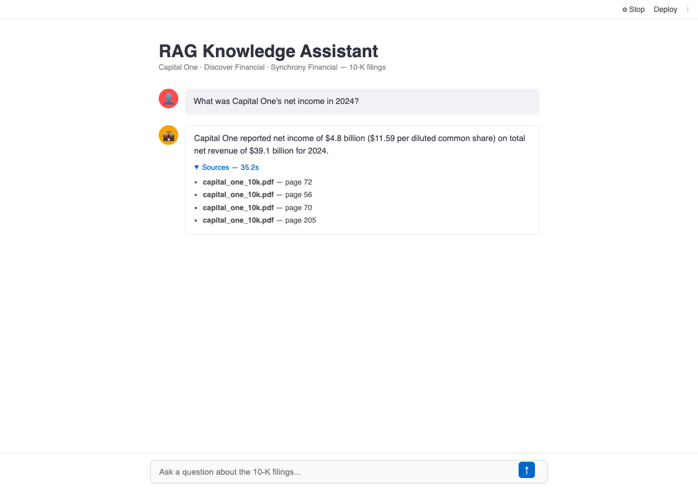

# RAG Knowledge Assistant

Ask natural language questions across Capital One, Discover Financial, and Synchrony Financial 10-K filings.

---

## Demo



---

## What it does

Ingests three annual 10-K filings as PDF documents, splits them into chunks, and stores them in a FAISS vector index. When a user asks a question, the system retrieves the most relevant chunks and passes them to a locally running LLaMA 3 model to generate an answer. Source documents and page numbers are returned alongside every response.

---

## Tech Stack


---

## Architecture

```
PDF Documents
    → Text Chunks (RecursiveCharacterTextSplitter, 1000 chars / 200 overlap)
    → Vector Embeddings (nomic-embed-text via Ollama)
    → FAISS Index (persisted to disk)
    → Retriever (top-4 chunks by similarity)
    → LLaMA 3 (via Ollama, runs locally)
    → Answer + Source Citations
```

---

## Evaluation Results

Metrics from `python -m evaluation.retrieval_eval` against the live index:

| Metric | Value |
|--------|-------|
| Chunks indexed | 3,650 across 3 filings |
| Hit rate | 1.0 |
| Source accuracy | 0.625 |
| MRR | 0.396 |
| Unit tests | 16 / 16 passing |

Hit rate measures whether any retrieved chunk contains an expected keyword. Source accuracy measures whether the correct company's filing appears in the top-4 results.

---

## Example Questions and Answers

**Q: What was Capital One's net income in 2024?**
> Capital One reported net income of $4.8 billion ($11.59 per diluted common share) for 2024.
> Sources: capital_one_10k.pdf (pages 56, 72)

**Q: What was Capital One's total net revenue in 2024?**
> Capital One reported total net revenue of $39.1 billion for 2024.
> Sources: capital_one_10k.pdf (pages 56, 70, 72)

**Q: What is Discover Financial's provision for credit losses?**
> Discover Financial's provision for credit losses was $11.7 billion in 2024, $10.4 billion in 2023, and $5.8 billion in 2022.
> Sources: discover_10k.pdf

---

## Prerequisites

- Python 3.9+
- [Ollama](https://ollama.com) running locally with both models pulled:

```bash
ollama pull llama3
ollama pull nomic-embed-text
```

---

## Setup

```bash
git clone https://github.com/FighterPegasus/RAG-Based-Knowledge-Assistant.git
cd RAG-Based-Knowledge-Assistant

python -m venv .venv
source .venv/bin/activate   # Windows: .venv\Scripts\activate

pip install -r requirements.txt
```

Place your PDF files in `data/`:
- `data/capital_one_10k.pdf`
- `data/discover_10k.pdf`
- `data/synchrony_10k.pdf`

Build the FAISS index (only needed once, or after changing the PDFs):

```bash
python -m embeddings.vector_store
```

---

## Running

**Streamlit UI:**
```bash
streamlit run app.py
```
Opens at http://localhost:8501

**FastAPI:**
```bash
uvicorn api.main:app --port 8000
```

Endpoints:
- `GET /health` — chain status
- `POST /ask` — body: `{"question": "..."}`, returns answer + sources + latency

**Docker:**
```bash
docker build -t rag-assistant .
docker run -p 8000:8000 -e OLLAMA_HOST=http://host.docker.internal:11434 rag-assistant
```

---

## Tests

```bash
pytest tests/test_pipeline.py -v
```

No live Ollama instance required — all external calls are mocked.

---

## MLflow

```bash
python -m monitoring.mlflow_logger
mlflow ui   # http://localhost:5000
```

Each query is logged as a run with latency, answer length, and sources as metrics.

---

## Project Structure

```
.
├── api/
│   └── main.py                 # FastAPI app
├── chains/
│   └── qa_chain.py             # RetrievalQA chain
├── data/
│   ├── *.pdf                   # not tracked in git
│   └── financial_summary.csv
├── embeddings/
│   └── vector_store.py         # FAISS build/load/query
├── evaluation/
│   └── retrieval_eval.py       # hit rate, source accuracy, MRR
├── exploration/
│   └── explore_data.py         # data inspection
├── faiss_index/                # not tracked in git
├── ingestion/
│   ├── pdf_loader.py
│   └── csv_loader.py
├── monitoring/
│   └── mlflow_logger.py
├── tests/
│   └── test_pipeline.py
├── app.py                      # Streamlit UI
├── Dockerfile
└── requirements.txt
```
